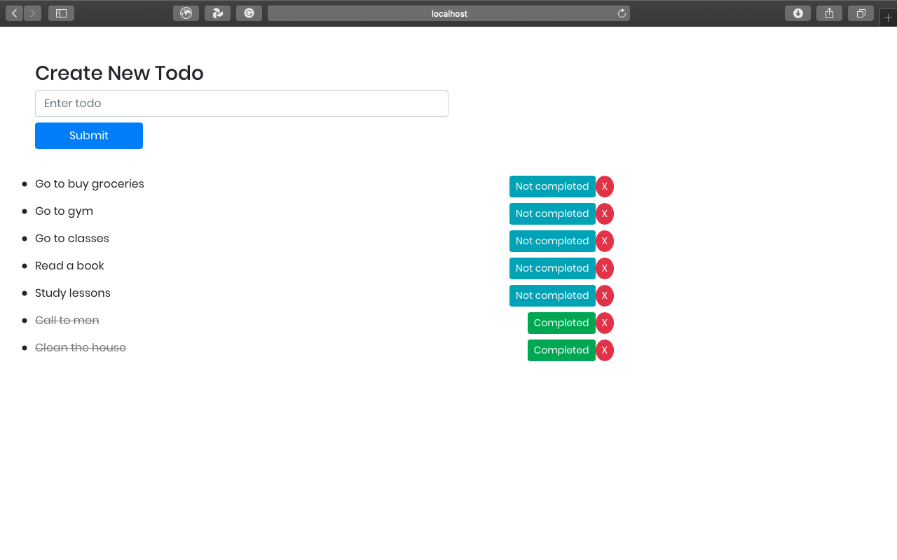

Clone the repo or download it

create a root folder to add server and client folders.

1 cd server,
npm install,
npm start or nodemon server.js

2 in the client side, from the root folder:

cd client,
yarn,
yarn start

